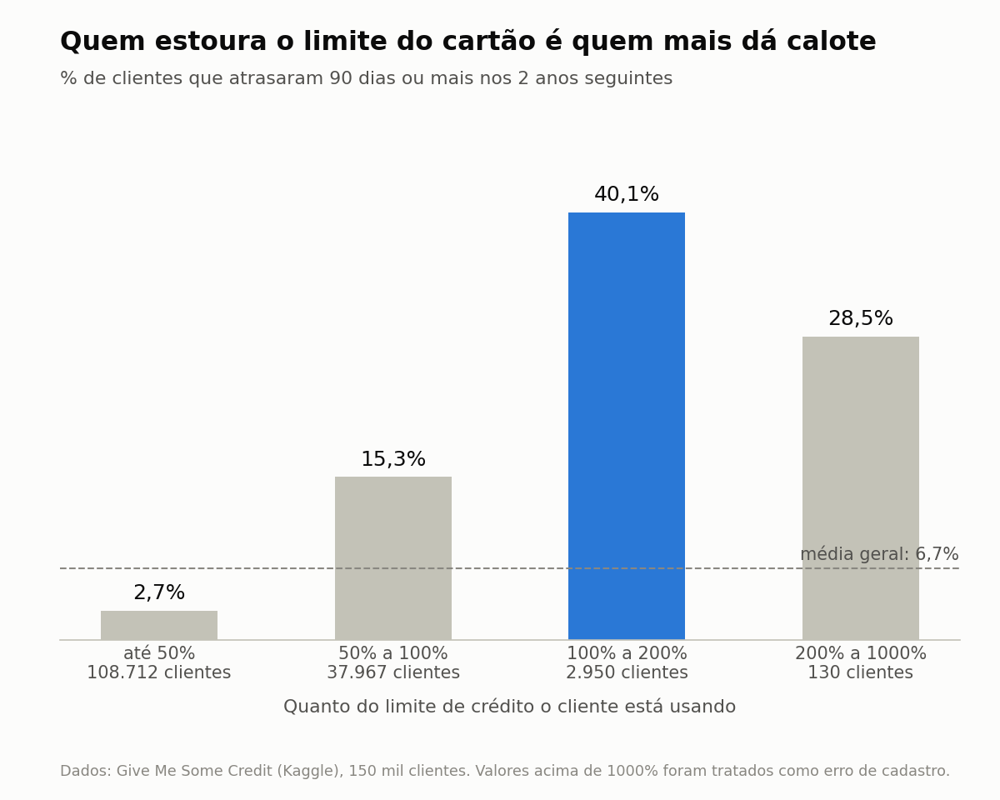

# Risco de crédito: Give Me Some Credit

Projeto de estudo. O objetivo é prever quais clientes vão atrasar 90 dias ou mais
nos dois anos seguintes, comparando três modelos.



## Dados

Base [Give Me Some Credit](https://www.kaggle.com/c/GiveMeSomeCredit), do Kaggle:
150 mil clientes, 6,7% de inadimplentes. O arquivo `cs-training.csv` não está no
repositório. Baixe na página da competição e coloque na pasta `dados/`.

## Principais achados

- Clientes que usam entre 100% e 200% do limite têm 40% de inadimplência, contra
  2,7% de quem usa menos da metade. Parecia erro e era o melhor sinal de risco.
- Para quase 32 mil clientes sem renda informada, a coluna `DebtRatio` guarda o
  valor da dívida, e não a proporção sobre a renda.
- Os valores 96 e 98 nas colunas de atraso são códigos, não quantidade de atrasos.

## Resultados no teste

| Modelo | AUC | Gini | KS |
|---|---|---|---|
| Regressão Logística | 0,857 | 0,714 | 0,553 |
| Random Forest | 0,865 | 0,730 | 0,575 |
| XGBoost | 0,868 | 0,735 | 0,582 |

O XGBoost ganha por 0,021 de Gini. Eu ficaria com a Regressão Logística, porque em
crédito poder explicar a decisão pesa mais do que essa diferença.

## Como rodar

```
pip install -r requirements.txt
python 01_diagnostico.py
python 03_modelos.py
```

O `03_modelos.py` usa os dados tratados pelo `pipeline.py`.

## Próximos passos

Ajuste de hiperparâmetros, teste de balanceamento de classes e definição do ponto de corte.
